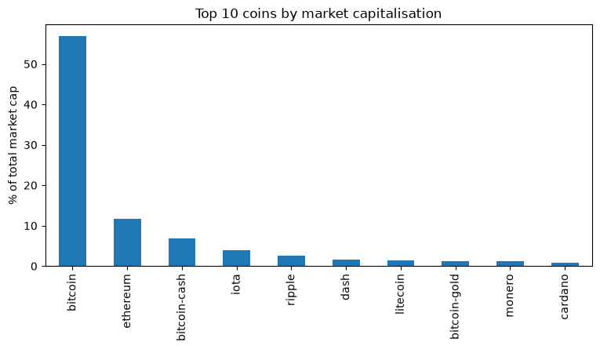

# Exploring the cryptocurrency market

A snapshot analysis of the cryptocurrency market on 6 December 2017: concentration, volatility and the long tail of tiny coins.



## Data

`datasets/coinmarketcap_06122017.csv`: one row per coin from the coinmarketcap API. The data comes from the DataCamp project of the same name.

## Key results

- Bitcoin was 57% of a $374 billion market; the four coins above $10 billion made up 79%.
- 87% of coins were worth under $50 million each and together made up 1.4% of the market.
- A typical daily move was 6-9% in every size class, with extremes of +833% and -96%.

## Running the notebook

```bash
pip install -r requirements.txt
jupyter notebook notebook.ipynb
```
